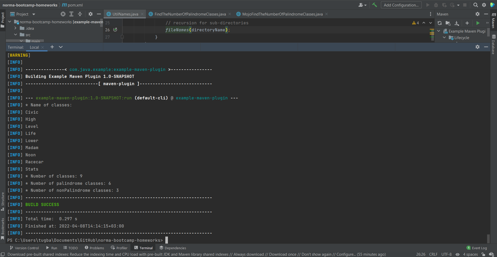

# tugbaAltun-FirstHomework
In this project, a maven-plugin has been written that checks whether the names of the classes in the specified directory are palindrome.

* myClasses folder and the classes in it were created symbolically in order to test the plugin.
* There are nine classes in the folder named myFolder. Classes are named in order: Civic, High, Level, Life, Lower, Madam, Noon, Racecar, Stats
* There are six palindrome words and they are: Civic, Level, Madam, Noon, Racecar, Stats.
* There are three non-palindrome names: High, Life, Lower
* So the results we expect to see in the terminal should be as follows.

---

# Installation

* Firstly, clone the repository from the github.
* After that, go to terminal and run this command in order.
  * mvn clean
  * mvn install
  * mvn com.java.example:example-maven-plugin:run
